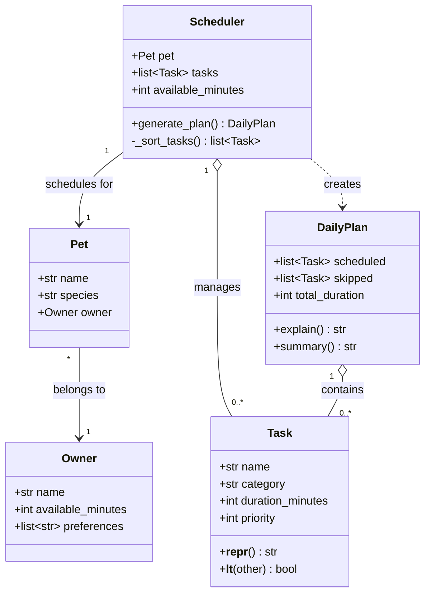

# PawPal+ Project Reflection

## 1. System Design

**a. Initial design**
Briefly describe your initial UML design.
What classes did you include, and what responsibilities did you assign to each?
---
The app is built around three core user actions:

1. **Enter owner and pet information.** The user provides basic context about themselves and their pet — such as the pet's name, type, and how much time the owner has available each day. This information sets the constraints the scheduler will work within.

2. **Add and manage care tasks.** The user creates a list of tasks their pet needs (walks, feeding, medication, grooming, enrichment, etc.), each with a duration and a priority level. The user can also edit or remove tasks as their pet's needs change.

3. **Generate and view a daily plan.** The user triggers the scheduler, which arranges tasks into a realistic daily schedule based on time availability and priority. The app displays the resulting plan and explains why tasks were ordered the way they were — helping the owner understand the reasoning, not just the outcome.

---

**Main objects:**

**Owner**
- Attributes: `name: str`, `available_minutes: int`, `preferences: list[str]`
- Responsibilities: stores the owner's daily time budget and any care preferences (e.g., prefers morning walks)

**Pet**
- Attributes: `name: str`, `species: str`, `owner: Owner`
- Responsibilities: identifies the pet and links it to the owner whose constraints apply

**Task**
- Attributes: `name: str`, `category: str`, `duration_minutes: int`, `priority: int` (1 = low, 5 = high)
- Methods: `__repr__()` for display; `__lt__()` to support priority-based sorting
- Responsibilities: represents a single care item the owner wants to schedule

**Scheduler**
- Attributes: `pet: Pet`, `tasks: list[Task]`, `available_minutes: int`
- Methods: `generate_plan() -> DailyPlan`, `_sort_tasks() -> list[Task]`
- Responsibilities: applies constraints (time budget) and priorities to decide which tasks fit and in what order

**DailyPlan**
- Attributes: `scheduled: list[Task]`, `skipped: list[Task]`, `total_duration: int`
- Methods: `explain() -> str`, `summary() -> str`
- Responsibilities: holds the scheduler's output and can articulate why each decision was made

---

**UML Class Diagram:**

**b. Design changes**

- Did your design change during implementation?
- If yes, describe at least one change and why you made it.

---

## 2. Scheduling Logic and Tradeoffs

**a. Constraints and priorities**

- What constraints does your scheduler consider (for example: time, priority, preferences)?
- How did you decide which constraints mattered most?

**b. Tradeoffs**

- Describe one tradeoff your scheduler makes.
- Why is that tradeoff reasonable for this scenario?

---

## 3. AI Collaboration

**a. How you used AI**

- How did you use AI tools during this project (for example: design brainstorming, debugging, refactoring)?
- What kinds of prompts or questions were most helpful?

**b. Judgment and verification**

- Describe one moment where you did not accept an AI suggestion as-is.
- How did you evaluate or verify what the AI suggested?

---

## 4. Testing and Verification

**a. What you tested**

- What behaviors did you test?
- Why were these tests important?

**b. Confidence**

- How confident are you that your scheduler works correctly?
- What edge cases would you test next if you had more time?

---

## 5. Reflection

**a. What went well**

- What part of this project are you most satisfied with?

**b. What you would improve**

- If you had another iteration, what would you improve or redesign?

**c. Key takeaway**

- What is one important thing you learned about designing systems or working with AI on this project?
